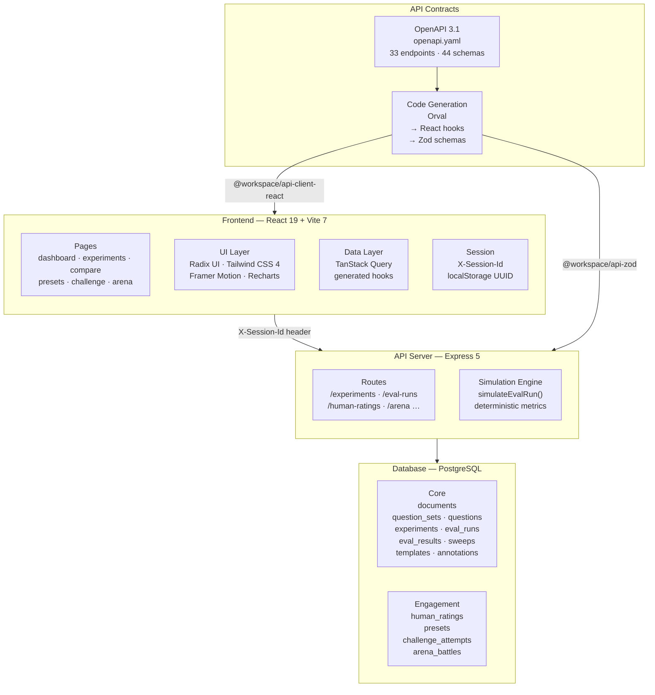
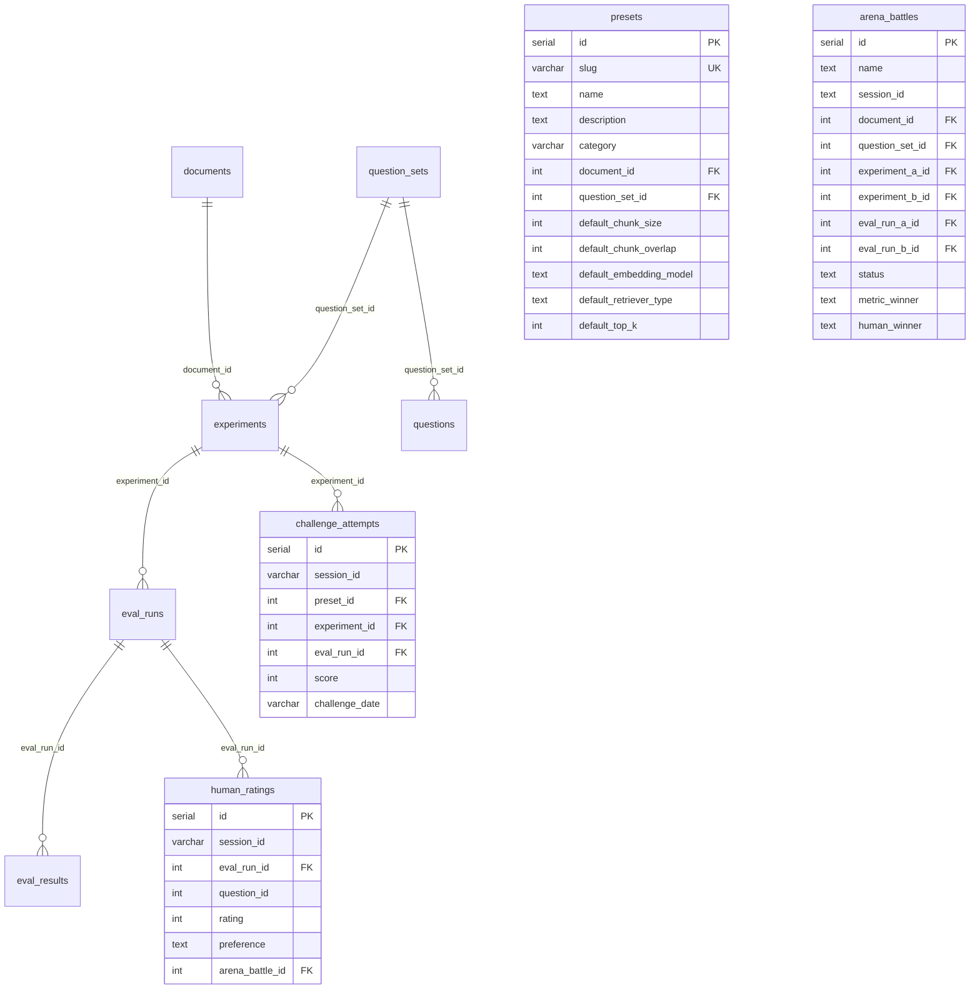
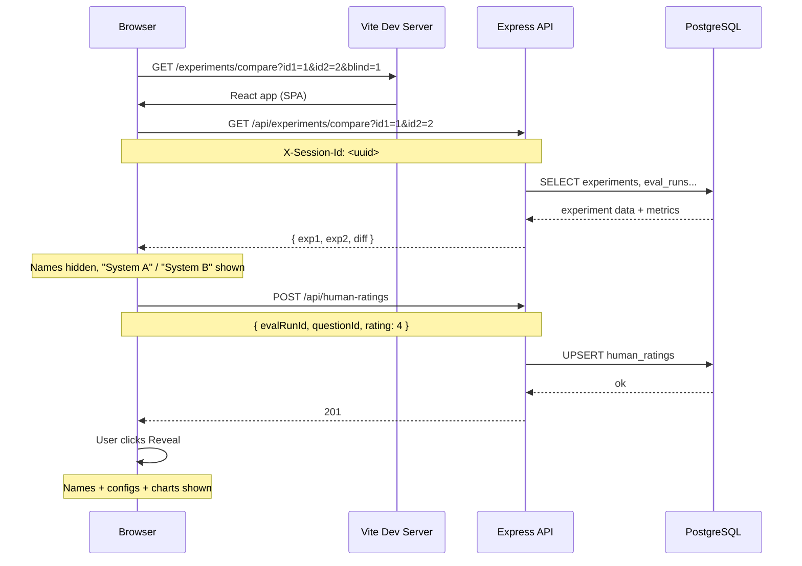
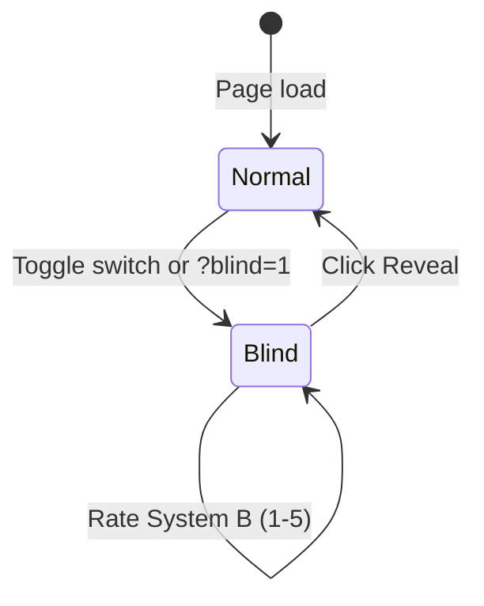
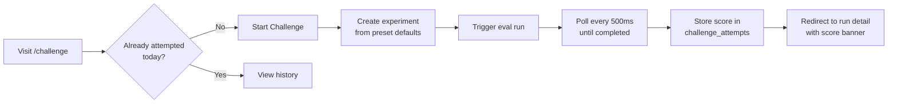
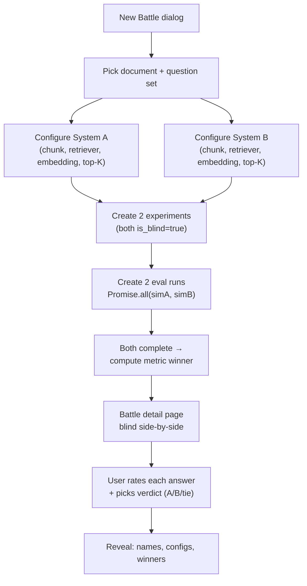

# RAG Evaluator Dashboard

A pnpm monorepo for building, running, and analyzing retrieval-augmented generation (RAG) evaluation workflows — with **blind evaluation**, **daily challenges**, and **arena battles**.

```text
┌──────────────────────────────────────────────────────────────────┐
│  RAG Evaluator Dashboard                                         │
│                                                                  │
│  ┌──────────┐  ┌──────────┐  ┌──────────┐  ┌───────────────┐   │
│  │ 📄 Docs  │  │ ❓ Qs   │  │ ⚙️ Exps  │  │ 📊 Dashboard  │   │
│  └──────────┘  └──────────┘  └──────────┘  └───────────────┘   │
│                                                                  │
│  ┌──────────┐  ┌──────────┐  ┌──────────┐  ┌───────────────┐   │
│  │ 👁 Blind │  │ 🎯 Presets│  │ 🏆 Arena │  │ 🔥 Challenge  │   │
│  └──────────┘  └──────────┘  └──────────┘  └───────────────┘   │
│                                                                  │
└──────────────────────────────────────────────────────────────────┘
```

## Features

### Core
| Feature | Description |
|---|---|
| **Documents** | Upload and manage source documents for RAG evaluation |
| **Question Sets** | Define reusable question sets with ground-truth answers |
| **Experiments** | Configure RAG parameters (chunk size, embedding model, retriever type, top-K) |
| **Eval Runs** | Execute evaluation runs with synthetic or real RAG metrics |
| **Sweeps** | Parameter sweep generation — run multiple configs at once |
| **Leaderboard** | Rank experiments by faithfulness, recall, and latency |
| **Trends** | Per-experiment metric trends with regression detection |
| **Templates** | Save and reuse parameter combinations (preset + custom) |

### Engagement (new)
| Feature | Description |
|---|---|
| **Blind Mode** 👁 | Hide system identities during comparison — rate answers without bias, then reveal |
| **Preset Scenarios** 🎯 | Curated document + question bundles. One click to launch an evaluation |
| **Daily Challenge** 🔥 | Deterministic daily preset. Score your run, beat your best |
| **RAG Arena** 🏆 | Pit two RAG configs head-to-head. Blind side-by-side. Human + metric verdict |

---

## Architecture



## Data model



## Request flow



## Monorepo structure

```text
.
├── artifacts/
│   ├── api-server/              # Express 5 backend
│   │   └── src/
│   │       ├── routes/          # 15 route modules
│   │       │   ├── experiments.ts    # CRUD + compare + blind toggle
│   │       │   ├── eval-runs.ts      # Trigger + simulate + blind endpoint
│   │       │   ├── human-ratings.ts  # Session-scoped star ratings
│   │       │   ├── presets.ts        # Curated scenarios + one-click use
│   │       │   ├── challenge.ts      # Daily challenge + polling scorer
│   │       │   ├── arena.ts          # Head-to-head battles + finalize
│   │       │   ├── comparison.ts     # Two-experiment diff
│   │       │   ├── trends.ts         # Metric time-series + regressions
│   │       │   ├── templates.ts      # Reusable config templates
│   │       │   ├── sweeps.ts         # Parameter sweep generation
│   │       │   ├── dashboard.ts      # Aggregate metrics summary
│   │       │   ├── leaderboard.ts    # Cross-experiment rankings
│   │       │   ├── documents.ts      # Document CRUD
│   │       │   ├── question-sets.ts  # Question set CRUD + import
│   │       │   └── health.ts
│   │       ├── app.ts           # Express app + /api prefix
│   │       └── index.ts         # Entry point (PORT, start)
│   ├── rag-eval/                # React 19 + Vite 7 dashboard
│   │   └── src/
│   │       ├── pages/           # 17 page components
│   │       │   ├── dashboard.tsx
│   │       │   ├── experiments.tsx
│   │       │   ├── experiment-detail.tsx
│   │       │   ├── experiment-comparison.tsx  # Blind mode toggle
│   │       │   ├── experiment-trends.tsx
│   │       │   ├── eval-run-detail.tsx        # Challenge score banner
│   │       │   ├── presets.tsx                # Preset cards + Use button
│   │       │   ├── challenge.tsx              # Daily challenge + history
│   │       │   ├── arena.tsx                  # Battle list + New dialog
│   │       │   ├── arena-detail.tsx           # Blind side-by-side view
│   │       │   ├── templates-library.tsx
│   │       │   ├── leaderboard.tsx
│   │       │   ├── sweeps.tsx
│   │       │   ├── sweep-detail.tsx
│   │       │   ├── documents.tsx
│   │       │   ├── question-sets.tsx
│   │       │   └── question-set-detail.tsx
│   │       ├── components/
│   │       │   ├── ui/          # Radix + Tailwind (shadcn-style)
│   │       │   ├── layout/      # App shell + sidebar nav
│   │       │   └── blind/       # HumanRatingPanel (star ratings)
│   │       └── lib/
│   │           ├── session-id.ts  # localStorage UUID
│   │           └── utils.ts
│   └── mockup-sandbox/          # UI prototyping sandbox
├── lib/
│   ├── api-spec/                # OpenAPI 3.1 source
│   │   ├── openapi.yaml         # 33 endpoints · 44 schemas
│   │   └── orval.config.mjs     # Codegen config (React + Zod)
│   ├── api-client-react/        # Generated TanStack Query hooks
│   │   └── src/
│   │       ├── generated/       # api.ts + api.schemas.ts (auto)
│   │       ├── custom-fetch.ts  # X-Session-Id header injection
│   │       └── index.ts
│   ├── api-zod/                 # Generated Zod schemas
│   │   └── src/
│   │       ├── generated/       # api.ts (auto)
│   │       └── index.ts
│   └── db/                      # Drizzle ORM schemas
│       └── src/
│           └── schema/
│               ├── documents.ts
│               ├── question-sets.ts
│               ├── experiments.ts    # + eval_runs + eval_results
│               ├── templates.ts      # + experiment_annotations
│               ├── sweeps.ts
│               ├── human-ratings.ts  # Anonymous star ratings
│               ├── presets.ts        # Curated scenarios
│               ├── challenge-attempts.ts
│               └── arena-battles.ts
└── scripts/                     # Seed scripts
    └── src/
        ├── seed-presets.ts      # 4 curated scenarios
        └── seed-dummy-data.ts   # 12 experiments + 24 eval runs
```

## Tech stack

| Layer | Technology |
|---|---|
| **Frontend** | React 19 · Vite 7 · Tailwind CSS 4 · TanStack Query · Recharts · Framer Motion · Radix UI |
| **Backend** | Express 5 · Pino · esbuild |
| **Database** | PostgreSQL · Drizzle ORM · drizzle-kit |
| **API Contracts** | OpenAPI 3.1 · Orval (React Query + Zod codegen) |
| **Tooling** | TypeScript · pnpm workspaces · Node.js 24+ |

## Feature deep-dives

### Blind Evaluation Mode

Toggles on the **Compare Experiments** page via `?blind=1`. When active:

- Experiment names are replaced with **"System A" / "System B"**
- Configuration details (chunk size, embedding, retriever) are **hidden**
- Radar charts, bar charts, winner banners, and metric diffs are **suppressed**
- Each system shows a **5-star rating panel** — ratings persist to `human_ratings` via `X-Session-Id`
- Click **Reveal** to drop blind mode and see the real identities



### Preset Scenarios + Challenge

**Presets** are pre-seeded document + question set bundles. Each comes with sensible RAG defaults.

| Preset | Category | Questions |
|---|---|---|
| Payments API Reference | `technical` | 4 |
| Service Terms of Use | `legal` | 4 |
| Password Reset Guide | `support` | 4 |
| Kingdom of Eldoria | `fantasy` | 5 |

**Daily Challenge** picks one preset deterministically (hash of `YYYY-MM-DD` mod preset count). Everyone gets the same preset each day. Score = `round((avgFaithfulness + avgContextRecall) / 2 × 100)`.



### RAG Arena

Head-to-head blind battles between two RAG configurations.



## Getting started

### Prerequisites

- Node.js 24+
- pnpm
- PostgreSQL (or a cloud PostgreSQL URL like Neon)

### Setup

```bash
# Clone and install
pnpm install

# Set your database URL
export DATABASE_URL="postgresql://..."

# Push schema to database
pnpm --filter @workspace/db push

# Seed presets (4 curated scenarios)
pnpm --filter @workspace/scripts seed:presets

# Seed dummy data (12 experiments + 24 eval runs)
pnpm --filter @workspace/scripts seed:dummy

# Typecheck the workspace
pnpm typecheck
```

### Development

Start both servers:

```bash
# Terminal 1 — API server
DATABASE_URL="postgresql://..." PORT=3001 \
  pnpm --filter @workspace/api-server dev

# Terminal 2 — Frontend (proxies /api → localhost:3001)
PORT=5173 BASE_PATH=/ \
  pnpm --filter @workspace/rag-eval dev
```

Open **http://localhost:5173** in your browser.

### API codegen

Edit `lib/api-spec/openapi.yaml`, then regenerate:

```bash
pnpm --filter @workspace/api-spec codegen
```

This produces:
- `lib/api-client-react/src/generated/api.ts` + `api.schemas.ts` — TanStack Query hooks
- `lib/api-zod/src/generated/api.ts` — Zod schemas
- Runs `tsc --build` to verify generated code compiles

## Evaluation metrics

| Metric | Description | Range |
|---|---|---|
| **Faithfulness** | How well the generated answer is grounded in retrieved context | 0.0–1.0 |
| **Context Recall** | How much of the ground truth is present in the retrieved chunks | 0.0–1.0 |
| **Latency** | Simulated response time in milliseconds | varies by config |

The current implementation uses a **deterministic simulation engine** (`simulateEvalRun`) that generates synthetic metrics based on RAG configuration parameters — no real LLM calls. To swap in real evaluation, replace `simulateEvalRun` in `artifacts/api-server/src/routes/eval-runs.ts`.

## Anonymous sessions

There is no authentication. Each browser gets a UUID stored in `localStorage["rag-eval.sessionId"]`, sent as the `X-Session-Id` header on every API request. This scopes human ratings, challenge attempts, and arena battles to a single browser session. The schema is ready for a future `user_id` column if authentication is added later.

## License

MIT
